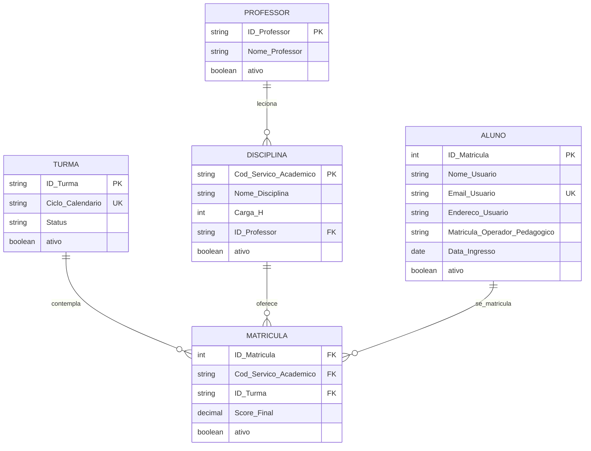

# Diagrama Entidade-Relacionamento (DER) - Normalizado em 3NF

## Visualização Mermaid

```mermaid
erDiagram
    PROFESSOR {
        string ID_Professor PK
        string Nome_Professor
        boolean ativo
    }
    TURMA {
        string ID_Turma PK
        string Ciclo_Calendario UK
        string Status
        boolean ativo
    }
    ALUNO {
        int ID_Matricula PK
        string Nome_Usuario
        string Email_Usuario UK
        string Endereco_Usuario
        string Matricula_Operador_Pedagogico
        date Data_Ingresso
        boolean ativo
    }
    DISCIPLINA {
        string Cod_Servico_Academico PK
        string Nome_Disciplina
        int Carga_H
        string ID_Professor FK
        boolean ativo
    }
    MATRICULA {
        int ID_Matricula FK
        string Cod_Servico_Academico FK
        string ID_Turma FK
        decimal Score_Final
        boolean ativo
    }
    PROFESSOR ||--o{ DISCIPLINA : "leciona"
    TURMA ||--o{ MATRICULA : "contempla"
    DISCIPLINA ||--o{ MATRICULA : "oferece"
    ALUNO ||--o{ MATRICULA : "se_matricula"
```