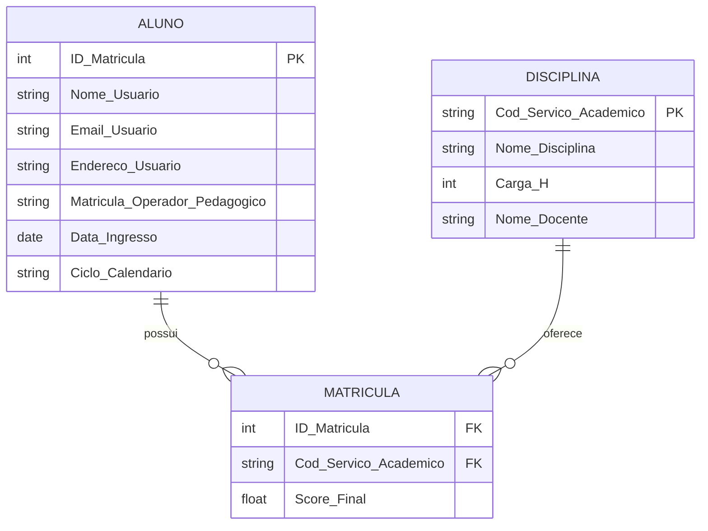

```mermaid
erDiagram
    ALUNO {
        int ID_Matricula PK
        string Nome_Usuario
        string Email_Usuario
        string Endereco_Usuario
        string Matricula_Operador_Pedagogico
        date Data_Ingresso
        string Ciclo_Calendario
    }
    DISCIPLINA {
        string Cod_Servico_Academico PK
        string Nome_Disciplina
        int Carga_H
        string Nome_Docente
    }
    MATRICULA {
        int ID_Matricula FK
        string Cod_Servico_Academico FK
        float Score_Final
    }
    ALUNO ||--o{ MATRICULA : "possui"
    DISCIPLINA ||--o{ MATRICULA : "oferece"
```
